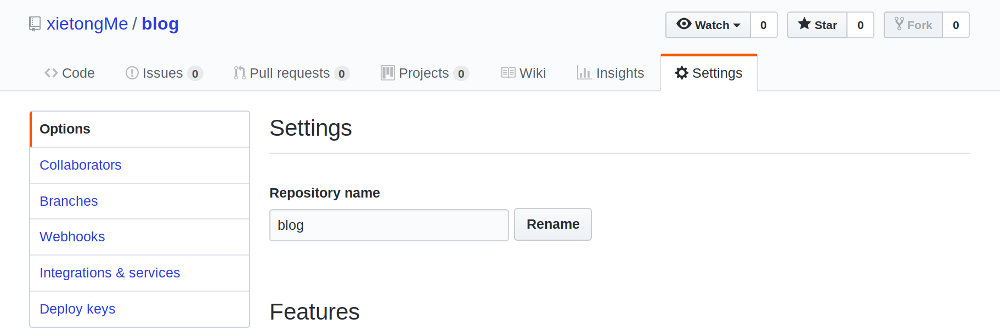

## 如何用GitHub Pages绑定你的个人域名

### 1. github Pages 的 CNAME 文件配置

直接在github仓库的Settings的GitHub Pages项直接设置Custom domain,github会自动添加CNAME文件
 

在此处我直接讲域名设置为blog.xietong.me也就是我想要的博客域名

### 2.域名解析配置
向你的DNS配置中添加三条记录
<pre>
<code>
@          A             192.30.252.153
@          A             192.30.252.154
www      CNAME           username.github.io.
</code>
</pre>
用自己的username替换上面第三个域名中的username

### 3.访问你的域名

访问成功